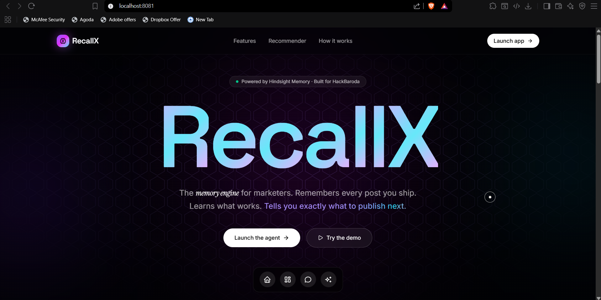
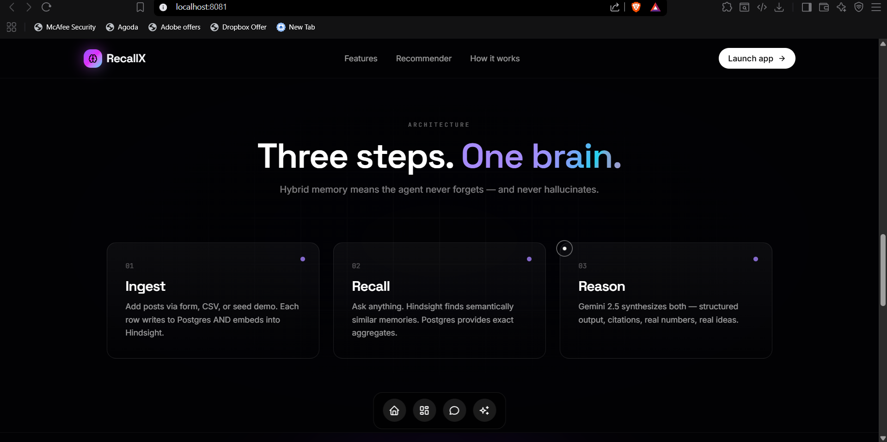
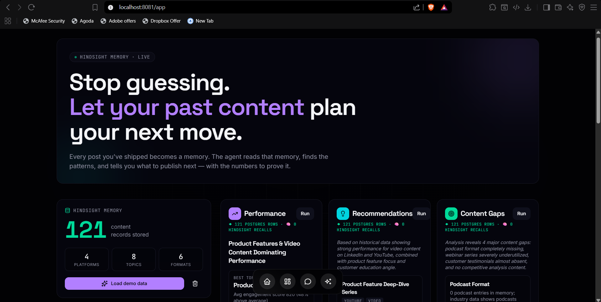
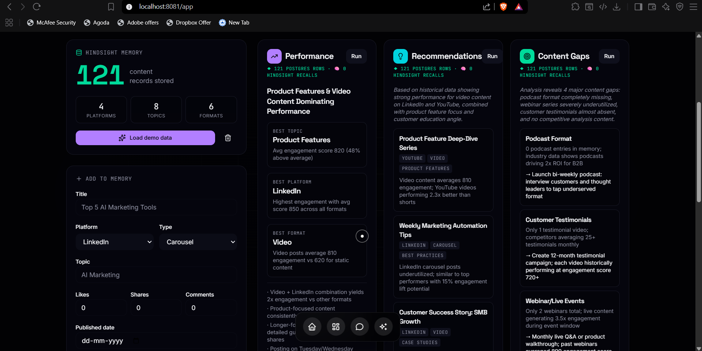
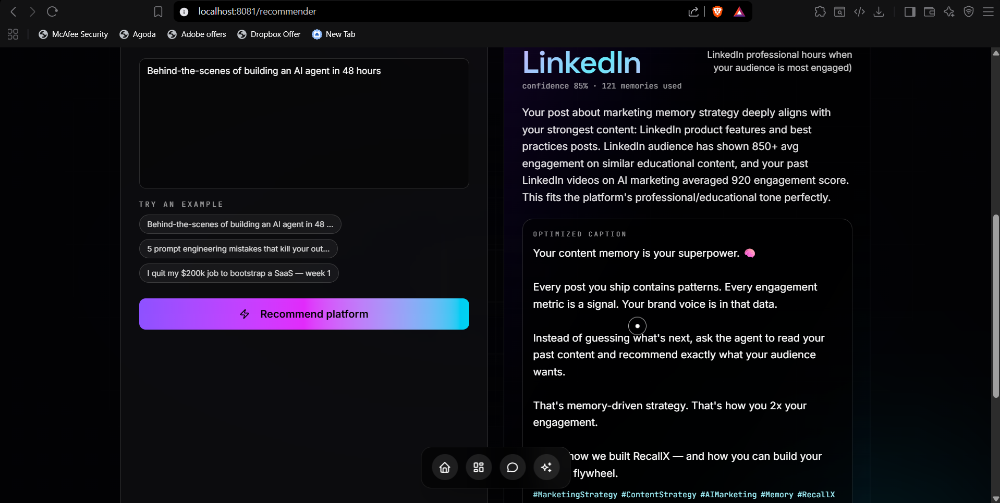
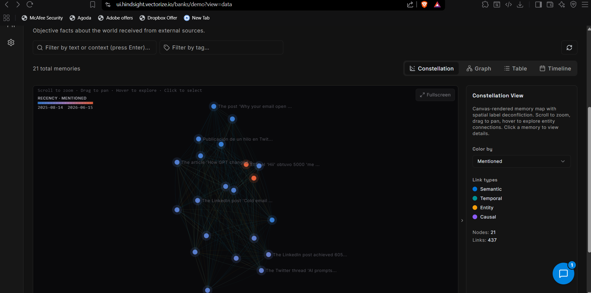
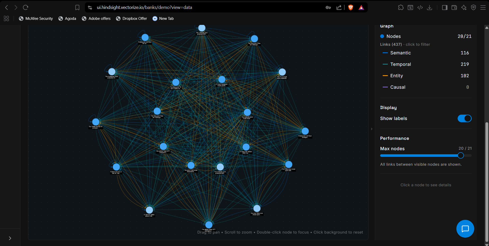
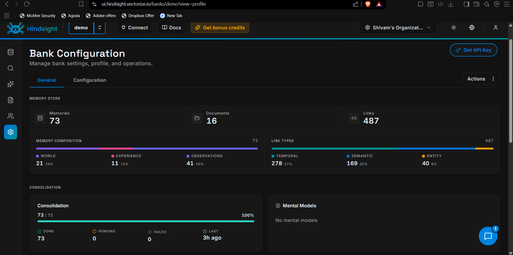

# Recall

Recall is a polished content strategy assistant built for HackBaroda. It is a marketing intelligence prototype that remembers published content, performance metrics, audience engagement, and brand voice guidance to recommend better content planning decisions.

This repository combines React, TanStack Start, Vite, Supabase, Tailwind CSS, and AI gateway-enabled memory to create a professional hackathon solution.

---

## Hackathon context

- **Event:** HackBaroda
- **Problem statement:** Content Strategy Agent
- **Objective:** Build an AI agent that remembers published content, performance history, audience engagement, and brand voice guidance.
- **Value:** Identify content gaps, recommend future topics, and improve marketing planning through memory-backed insights.

This project highlights how memory contributes to smarter marketing decisions by preserving historical performance and brand signals.

---

## Project overview

- **Framework:** React 19 + Vite
- **Routing:** TanStack React Router / TanStack Start file-based routing
- **Styling:** Tailwind CSS with utility-first design
- **Backend integration:** Supabase authentication and data services
- **AI gateway support:** Configurable AI gateway integration via environment variables
- **Design influence:** Aligned with managed memory and agent workflow patterns like Hindsight Cloud

---

## Key features

- Fully typed TypeScript application
- Responsive, accessible UI components under `src/components/ui`
- Custom app shell and route tree via `src/router.tsx` and `src/routes`
- Supabase auth and client integration in `src/integrations/supabase`
- AI gateway abstraction in `src/lib/ai-gateway.server.ts`
- Modern build and dev tooling with Vite
- Clean routing conventions documented in `src/routes/README.md`

---

## Solution summary

Recall is built to solve the hackathon Content Strategy Agent problem by:

- preserving content history and metadata
- tracking performance and engagement over time
- storing brand voice guidelines and campaign context
- identifying content gaps and topic opportunities
- recommending future content ideas based on past success

The app is a memory-aware marketing assistant, not a static dashboard.

---

## Memory-driven marketing workflow

1. Capture published content records and campaign metadata.
2. Record performance metrics, audience signals, and engagement events.
3. Store brand voice and content guidance for future reference.
4. Analyze historical success to identify gaps and opportunities.
5. Generate recommendations for new content aligned with brand and audience trends.

This workflow demonstrates how memory enables smarter marketing decisions and more consistent content planning.

---

## Architecture

### Core layers

- `src/routes` — file-based routes and page-level components
- `src/components` — shared UI components and layout primitives
- `src/integrations/supabase` — Supabase client and auth middleware
- `src/lib` — application utilities, AI gateway helpers, error handling, and data helpers
- `src/router.tsx` — router definitions and route registration

### Runtime behavior

- `start.ts` — application entry point for client-side initialization
- `server.ts` — server integration for rendered routes and middleware
- `.env` — environment configuration for Supabase and AI gateway access

---

## Installation

### Prerequisites

- Node.js 20+ recommended
- npm or Bun available

### Setup

1. Clone the repository

```bash
git clone <your-repo-url> recall
cd recall
```

2. Install dependencies

```bash
npm install
```

> If you use Bun, you may also use `bun install`.

3. Create a local environment file

```bash
cp .env.example .env
```

4. Fill in the required values in `.env`

- `SUPABASE_URL`
- `SUPABASE_PUBLISHABLE_KEY`
- `AI_GATEWAY_API_KEY`
- `AI_GATEWAY_URL`

---

## Development

Start the dev server:

```bash
npm run dev
```

Build for production:

```bash
npm run build
```

Preview the production build:

```bash
npm run preview
```

Lint the repository:

```bash
npm run lint
```

Format the repository:

```bash
npm run format
```

---

## Environment variables

The app relies on the following environment variables:

- `SUPABASE_URL` — Supabase project URL
- `SUPABASE_PUBLISHABLE_KEY` — public Supabase key used by the client
- `VITE_SUPABASE_URL` — Vite-exposed Supabase URL for browser requests
- `VITE_SUPABASE_PUBLISHABLE_KEY` — Vite-exposed Supabase public key
- `AI_GATEWAY_API_KEY` — API key for the configured AI gateway
- `AI_GATEWAY_URL` — Base URL for AI gateway requests

Make sure your local `.env` is not committed if it contains secret keys.

---

## Routing conventions

Routing is file-based and documented in `src/routes/README.md`.

Common patterns:

- `src/routes/index.tsx` → `/`
- `src/routes/about.tsx` → `/about`
- `src/routes/users/$id.tsx` → `/users/:id`
- `src/routes/files/$.tsx` → wildcard routes

Do not use Next.js or Remix conventions such as `app/layout.tsx` or `src/pages/`.

---

## Supabase integration

Supabase integration is implemented under `src/integrations/supabase`:

- `client.ts` — browser Supabase client
- `client.server.ts` — server-side Supabase client
- `auth-attacher.ts` — attaches auth state to requests
- `auth-middleware.ts` — middleware for authenticated routes

This repo is set up to support authentication, session-aware data access, and server-side Supabase operations.

---

## AI gateway and managed memory

The application includes AI gateway support via `src/lib/ai-gateway.server.ts`. The architecture is designed to support workflows that resemble managed agent memory patterns, like the Hindsight Cloud demo at `https://ui.hindsight.vectorize.io/banks/demo?view=data`.

The demo page illustrates:

- Managed cloud memory for agent workflows
- Secure authentication UX
- A multi-tenant memory bank experience

This repository can be extended to support those same concepts through the AI gateway and structured route/data handling already present.

---

## Project structure

- `src/components` — UI components, app navigation, custom cursor, preloader, etc.
- `src/components/ui` — reusable accessible primitives based on Radix UI
- `src/hooks` — custom React hooks
- `src/lib` — application utilities and server helpers
- `src/integrations/supabase` — Supabase integration code
- `src/routes` — route components and route tree
- `public` — static assets

---

## Important files

- `src/router.tsx` — route registration and navigation logic
- `src/routes/__root.tsx` — application shell and layout wrapper
- `src/routes/README.md` — routing conventions and documentation
- `src/lib/ai-gateway.server.ts` — AI gateway abstraction layer
- `src/integrations/supabase/client.ts` — browser Supabase client
- `src/integrations/supabase/client.server.ts` — server Supabase client
- `src/integrations/supabase/auth-middleware.ts` — protected route handling
- `src/components/ui` — accessible primitives and reusable UI patterns

---

## Deployment

Deploy the app using your preferred Vite-compatible hosting provider. Typical steps:

1. Build the app: `npm run build`
2. Deploy the generated output from `dist/`
3. Ensure environment variables are configured in the hosting platform

For server-side Supabase or AI gateway features, verify the hosting provider supports server middleware or edge functions as needed.

---

## Contributing

- Use `npm run lint` before committing
- Keep UI components reusable and accessible
- Add new routes under `src/routes`
- Preserve file-based routing and layout conventions

---

## License

This project is released under the terms of the existing `LICENSE` file.

---
## Screenshots

<p align="center">
  
</p>

<p align="center">
  
</p>

<p align="center">
  
</p>


<p align="center">
  
</p>


<p align="center">
  
</p>


<p align="center">
  
</p>

<p align="center">
  
</p>

<p align="center">
  
</p>

---

### Team Members

* Veer Pratap Singh
* Nirbhay Gurjar

---

Made with ❤️ by Team Developers.

